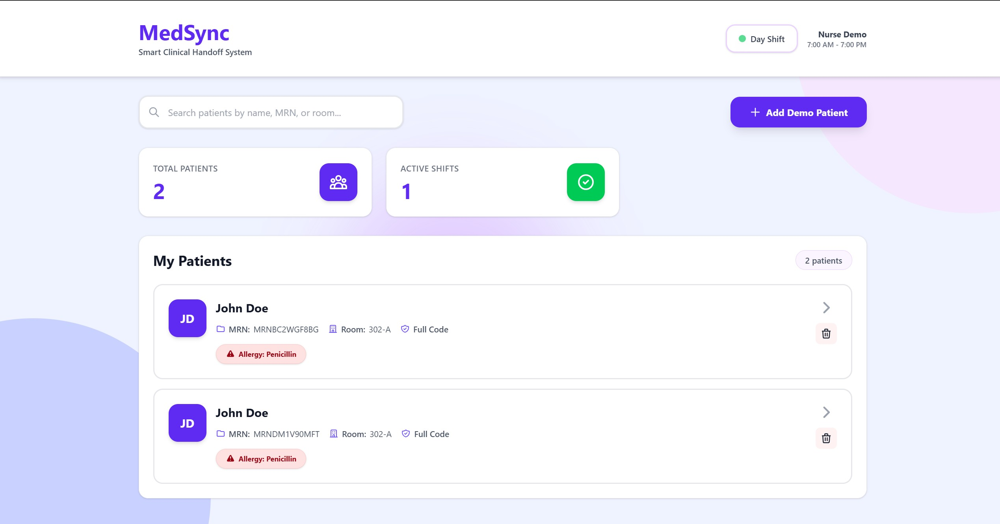

# MedSync — AI-Powered Clinical Handoff System

A hybrid AI system that reduces nurse shift-change documentation time from 20+ minutes to under 5 seconds. Combines rule-based critical detection with LLM-powered summarization for reliable, intelligent clinical handoffs.



## Features

### Clinical Documentation
- **Vital Signs Tracking** with real-time critical alerts (BP, HR, Temp, O2)
- **Medication Change Logging** (started, held, increased, decreased, discontinued)
- **Timestamped Clinical Notes** with collaborative documentation
- **Previous Shift Handoffs** for continuity of care

### Hybrid AI Architecture
- **Rule-Based Critical Detection** — 100% reliability on life-critical vitals
  - BP < 90 or > 140 mmHg → Hypotension/Hypertension
  - HR < 60 or > 100 BPM → Bradycardia/Tachycardia
  - Temp > 38.0°C → Febrile
  - O2 < 95% → Hypoxic
- **LLM-Powered Summarization** — Llama 3.2 generates natural clinical narratives
- **Privacy by Design** — Runs entirely on local Ollama (no cloud API calls)

### Smart Handoff Generation
- **Critical Items** — Auto-flagged abnormal vitals and medication changes
- **Stable Items** — AI-extracted routine observations (only when no critical alerts)
- **Pending Tasks** — Explicit tasks + AI-extracted from notes
- **Narrative Summary** — 2-3 sentence clinical overview

### User Experience
- **Dashboard** with active shifts, pending handoffs, and patient overview
- **Toast Notifications** for all actions (no browser alerts)
- **Modal Confirmations** with frosted glass backdrop
- **Form Validation** with red borders and inline error messages
- **Delete Functionality** for patients, medications, and notes
- **Auto-Replace Vitals** — Only latest vitals used (no stale data)

---

## Tech Stack

### Frontend
- **React** — Component-based UI with hooks
- **React Router** — Client-side routing
- **Tailwind CSS** — Utility-first styling
- **Axios** — HTTP client for API calls
- **Custom Components** — Modal, Toast, VitalsForm, MedicationList, etc.

### Backend
- **FastAPI** — Modern Python web framework
- **SQLAlchemy** — SQL ORM with Alembic migrations
- **Pydantic** — Data validation and serialization
- **SQLite** — Lightweight database (PostgreSQL-ready)
- **Uvicorn** — ASGI server

### AI/ML
- **Llama 3.2 (3B)** — Meta's open-source LLM
- **Ollama** — Local LLM runtime (no cloud APIs)
- **Hybrid Logic** — Rules + AI for reliability + intelligence

---

## Installation & Setup

### 1️⃣ Backend Setup
```bash
# Navigate to backend directory
cd backend

# Create virtual environment (recommended)
python -m venv venv

# Activate virtual environment
# On macOS/Linux:
source venv/bin/activate
# On Windows:
venv\Scripts\activate

# Install dependencies
pip install -r requirements.txt

# Run the backend server
uvicorn app.main:app --reload

```

### 2️⃣ Frontend Setup

Open a **new terminal** (keep backend running):
```bash
# Navigate to frontend directory
cd frontend

# Install dependencies
npm install

# Start development server
npm run dev

---

### Ollama Setup (AI Model)

Open a **third terminal**:
```bash
# Install Ollama (if not already installed)
# macOS/Linux:
curl -fsSL https://ollama.com/install.sh | sh

# Windows: Download from https://ollama.com/download

# Start Ollama server
ollama serve

# Pull Llama 3.2 model (one-time download, ~2GB)
ollama pull llama3.2:3b